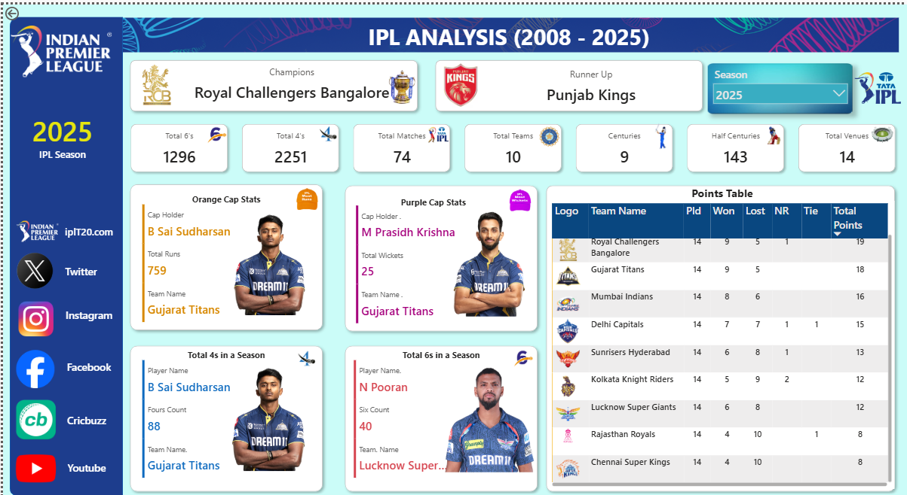
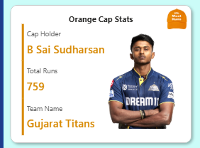
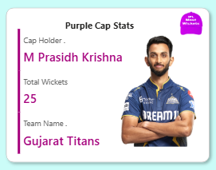
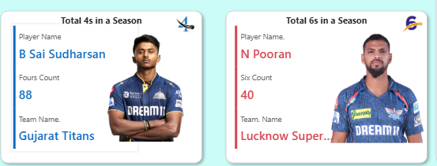

# 🏏 IPL Analysis Dashboard (2008–2025)

📊 A dynamic, feature-rich, and interactive **Power BI Dashboard** analyzing **17 seasons** of the Indian Premier League (IPL) from 2008 to 2025. Dive deep into team and player performances, trends, and match results — all through visually stunning reports and insightful metrics.

---

## 📌 Project Overview

This project provides an end-to-end analytical view of IPL performance, season by season. Designed for clarity and storytelling, it offers powerful features like:

- 🧢 **Orange Cap Analysis** – Highest run scorers per season
- 🎯 **Purple Cap Analysis** – Most wickets by a bowler each year
- 💥 **Maximum Sixes & Fours** – Hard-hitting batsman insights
- 🏆 **Dynamic Points Table** – Track team standings season-wise
- 🔍 **Team vs. Player Performance** – Across formats and years
- 📉 **Trends & Visualizations** – Graphical insights year-over-year

> ⚡ **Crafted with precision and powered entirely by DAX queries,** every statistic, leaderboard, and visual insight is calculated through custom DAX expressions — delivering accuracy, reusability, and performance. From dynamic rankings to conditional formatting, all transformations were done within Power BI using the DAX engine without any external scripting or SQL.  

---

## 📷 Dashboard Screenshots

### 🏠 Home Overview

### 🧢 Orange Cap (Most Runs)

### 🎯 Purple Cap (Most Wickets)

### 💣 Sixes & Fours Analysis

### 📊 Season-Wise Points Table

---

## 💡 Key DAX Calculations

> Below are just a few examples of DAX measures used throughout this dashboard:

- `Total Runs = SUM(Batting[Runs])`
- `Most Sixes = CALCULATE(COUNTROWS(Batting), Batting[Type] = "6")`
- `Orange Cap = RANKX(ALL(Players), [Total Runs], , DESC)`
- `Total Wickets = COUNT(Wickets[Dismissal Type])`
- `Purple Cap = RANKX(ALL(Bowlers), [Total Wickets], , DESC)`
- `Points = CALCULATE(SUM(Results[Points]))`

✅ Over 50+ custom DAX measures were used to:
- Create leaderboards
- Handle filters dynamically
- Apply conditional visual cues
- Provide drill-downs by season, player, team, and more

---

## 🛠 Tools & Technologies Used

- **Power BI** – Main tool for visualization, data modeling, DAX
- **DAX (Data Analysis Expressions)** – All calculations & insights powered by custom measures
- **Excel** – Raw data cleaning and initial preprocessing
- **GitHub** – For version control and showcasing project

---

## 🎯 Ideal For

This project is an excellent showcase for:

- 🎓 **Aspiring Data Analysts / Business Intelligence Professionals**
- 📊 **Dashboard Designers & Power BI Users**
- 🏏 **Cricket and Sports Analytics Enthusiasts**
- 💼 **Recruiters** assessing real-world problem-solving via data storytelling

---

---

## 📁 Repository Contents

- `IPL Analysis.pbix` – Power BI project file  
- `IPL Analysis VIDEO.mp4` – Demo walkthrough video  
- `SS/` – Folder containing all dashboard screenshots  
- `README.md` – Project documentation

---

## 🧠 Learning Outcomes

Through this project, I gained practical experience in:

- Real-time dashboard design using best UI/UX practices  
- Advanced DAX measures and calculated columns  
- Interactive drill-through and tooltip-based navigation  
- End-to-end storyboarding using visuals and KPIs  
- Communicating actionable insights clearly for decision-makers

---

## 📬 Contact Me

👤 **Mayank Rana**  
📧 Email: [mayankrajputana9@gmail.com](mailto:mayankrajputana9@gmail.com)  
🌍 Location: Meerut, Delhi NCR  
🔗 [LinkedIn](https://www.linkedin.com/in/mayank-rana9368/)

---

## ⭐ Let’s Connect!

If you liked this project or found it helpful, please consider:

- Giving it a ⭐️ on GitHub  
- Sharing your feedback  
- Connecting with me on LinkedIn for collaborations!

---

## 🏷 Hashtags

`#PowerBI` `#IPLAnalysis` `#DAX` `#DashboardDesign` `#DataAnalytics` `#SportsAnalytics` `#DataVisualization` `#MayankRana`

---

